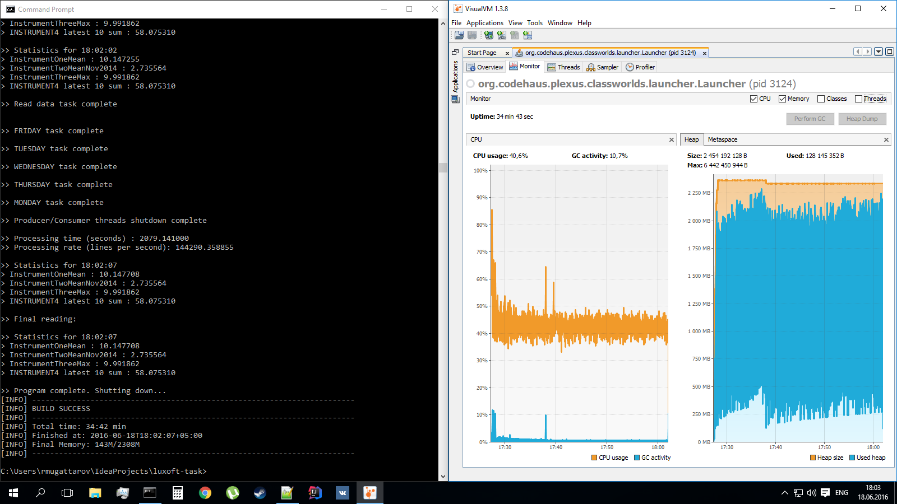

Financial Instrument Demo Application by Robert Mugattarov
==========================================================

Overview
--------

This application is an implementation of the Producer/Consumer design 
pattern running on seven threads:
* One producer thread.
* Five threads per each business day (Monday through Friday).
* The Main thread.

The producer uses Scanner to parse the source file and a poison pill 
to notify the consumers of exhaustion.
This application uses an H2 in-memory database to produce instrument 
value multipliers.
The multipliers are cached in a Guava LoadingCache.
The application prints the current instrument statistics in runtime and 
a message of completion once the source file is parsed and the consumer 
threads are done.

Software Requirements
---------------------

To build and run this application you will need:
- Maven3
- JDK8

Running
-------
1. cd to the source root and build the project:

        mvn clean package

2. Run the application with the path to the source file in exec.args value:

        mvn exec:java -Dexec.args="D:\\example_input.txt"

Load Test
---------

I tested this app against a source file of 300M lines (12.8GB). 
The instrument data was spread among 10K instruments. I used VisualVM
to monitor CPU and Heap usage. Heap usage peaked at 2.3GB and remained 
stable at 2GB with processing rate of 140K lines per second. Processing 
of the file took 35 min:
